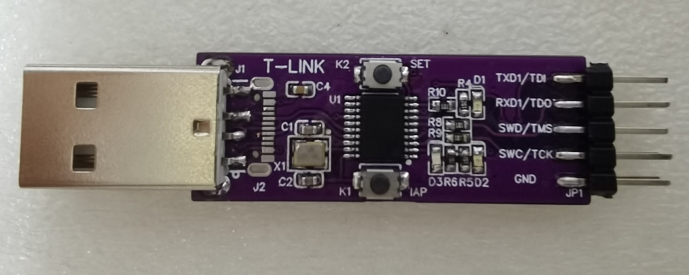

# FT-Link

------

此项目使用CH32V305FBP6实现了一个FT2232D设备，提供了一路JTAG接口和一路串口。  
本项目的目标是可以用此来烧写Gowin的FPGA设备。实测OpenFPGALoader和Gowin的下载工具都可以正常使用。  

JTAG接口是IO模拟的时序。最高速度可达6M，并可以调整。  
USB部分使用了CherryUSB库。  
项目使用MounRiver编译。 下载需使用WCH的DAP工具。 

本项目参考了Sipeed的 [RV-Debugger-BL702](https://github.com/sipeed/RV-Debugger-BL702) 的实现。  
本项目所用的硬件: https://oshwhub.com/tpunix/wch_dap

